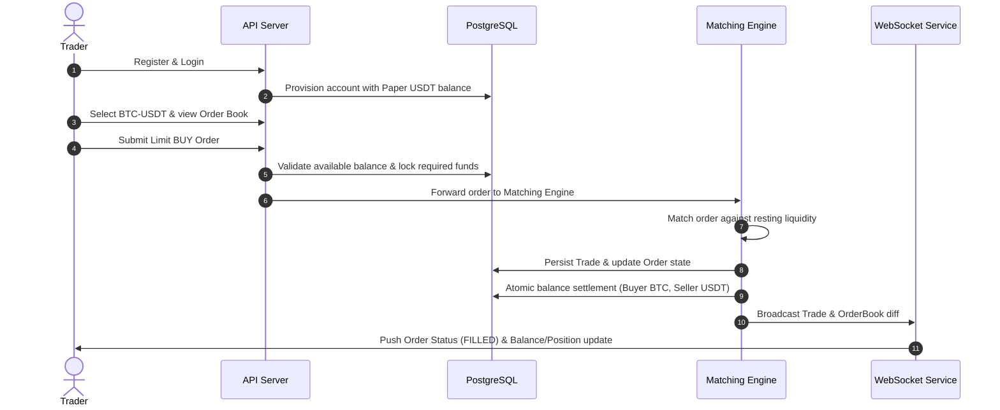
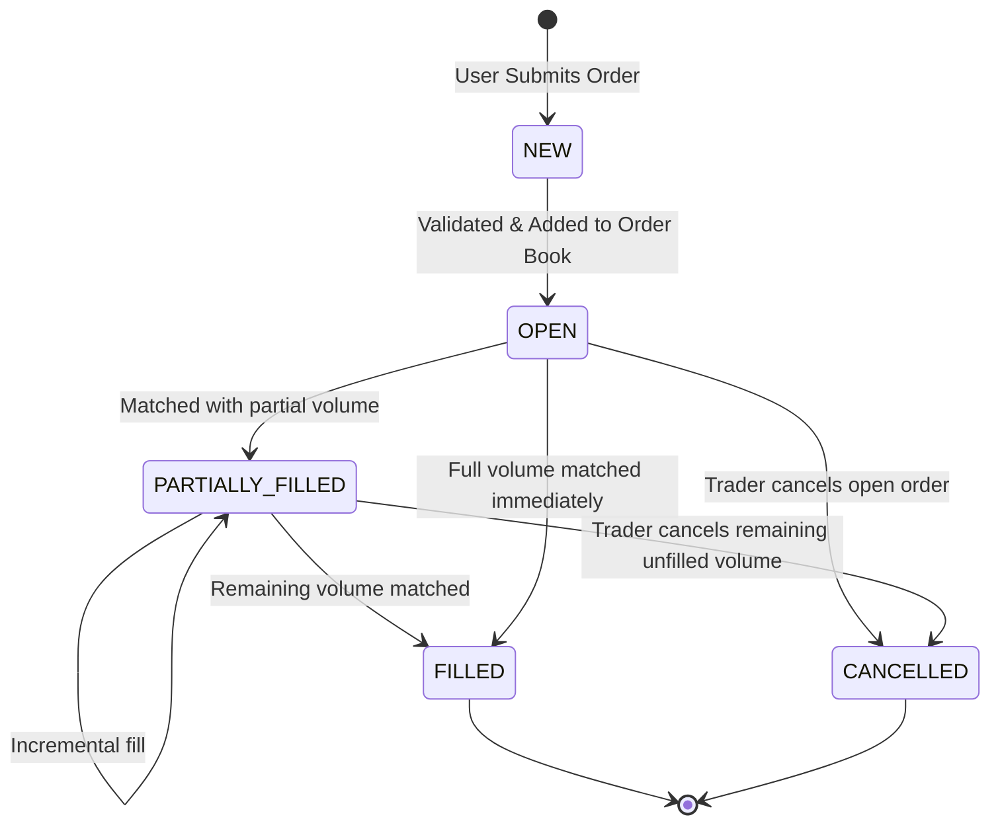
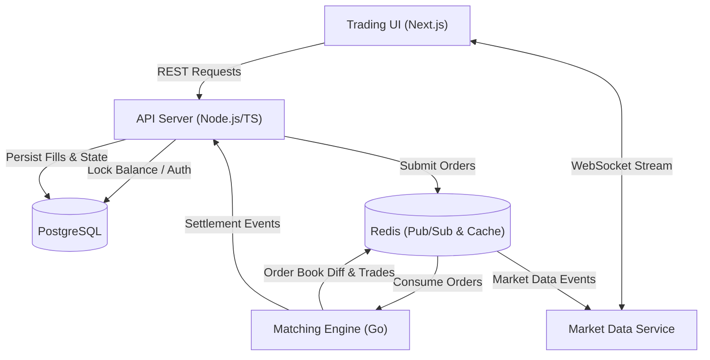

# Crypto Exchange — System Requirements & Specifications

> **Status:** MVP Specification & Architecture Document  
> **Target Asset:** BTC/USDT (Paper Trading)  
> **Matching Engine:** High-performance, In-Memory Price-Time Priority  

---

## Table of Contents
- [1. Functional Requirements — MVP](#1-functional-requirements--mvp)
  - [1.1 Users & Authentication](#11-users--authentication)
  - [1.2 Market Data](#12-market-data)
  - [1.3 Trading & Orders](#13-trading--orders)
  - [1.4 Positions & Leverage](#14-positions--leverage)
  - [1.5 Real-Time Capabilities](#15-real-time-capabilities)
- [2. Non-Functional Requirements (NFRs)](#2-non-functional-requirements-nfrs)
- [3. End-to-End User Flow](#3-end-to-end-user-flow)
- [4. Core Entities & Data Dictionary](#4-core-entities--data-dictionary)
- [5. Order Lifecycle & State Machine](#5-order-lifecycle--state-machine)
- [6. MVP Scope & Boundaries](#6-mvp-scope--boundaries)
- [7. Technology Stack](#7-technology-stack)
- [8. System Architecture & Components](#8-system-architecture--components)
- [9. Execution Flows & Invariants](#9-execution-flows--invariants)
  - [9.1 Order Placement Flow](#91-order-placement-flow)
  - [9.2 Failure Cases](#92-failure-cases)
  - [9.3 Matching Rules & Invariants](#93-matching-rules--invariants)
  - [9.4 Balance Rules & Invariants](#94-balance-rules--invariants)
  - [9.5 Position Rules & Invariants](#95-position-rules--invariants)
- [10. REST API Specification](#10-rest-api-specification)
- [11. WebSocket Specifications](#11-websocket-specifications)
- [12. Security Requirements](#12-security-requirements)

---

## 1. Functional Requirements — MVP

### 1.1 Users & Authentication
- **Registration / Login / Logout:** Secure onboarding and session management.
- **Account Balances:** Real-time visibility into available and locked paper balances.
- **Paper Money Transactions:** Virtual deposits and withdrawals to simulate live trading without financial risk.

### 1.2 Market Data
- **Supported Pairs:** Query active trading pairs (starting with `BTC-USDT`).
- **Live Ticker Price:** Instant view of latest mark/last traded prices.
- **Candlestick Charting:** Interactive OHLCV visualizer.
- **Real-Time Order Book:** Live Level-2 order book depth (bids and asks).
- **Recent Trades:** Public stream of executed trades in the market.

### 1.3 Trading & Orders
- **Market Orders:** Immediate execution against the resting order book.
- **Limit Orders:** Resting orders executed at a specified price or better.
- **Order Cancellation:** Cancel open and partially filled resting orders.
- **Partial Fills:** Incremental execution of order quantities.
- **Order Tracking:** Real-time views of active open orders, order history, and trade execution history.

### 1.4 Positions & Leverage
- **Long / Short Positions:** Directional exposure with paper assets.
- **Leverage Configuration:** Configurable multiplier per position/order.
- **Position Metrics:** Real-time tracking of entry price, mark price, and unrealized/realized P&L.
- **Position Management:** Full and partial closing of positions.
- **Liquidation Engine:** Basic margin-ratio monitoring and automated liquidation triggers.

### 1.5 Real-Time Capabilities
- Sub-second streaming of:
  - Order book updates (bids & asks depth)
  - Public trade stream
  - Order status updates (`FILLED`, `PARTIALLY_FILLED`, `CANCELLED`)
  - User position and margin/P&L calculations

---

## 2. Non-Functional Requirements (NFRs)

| Attribute | Requirement & Specification |
| :--- | :--- |
| **Correctness** | Zero tolerance for double execution, negative balances, or phantom fills. |
| **Consistency** | Strict transactional consistency across orders, balances, and positions. |
| **Performance** | Ultra-low latency order matching and sub-50ms API response times. |
| **Concurrency** | Thread-safe, lock-free or atomically isolated handling of simultaneous orders. |
| **Scalability** | Horizontally scalable stateless API & market data broadcast layers. |
| **Availability** | High availability with graceful degradation during partial node outages. |
| **Reliability** | Idempotent order placement/cancellation and durable event streaming. |
| **Security** | Secure token auth, strict schema validation, rate limiting, and RBAC. |
| **Observability** | Structured JSON logs, OpenTelemetry tracing, Prometheus metrics, health checks. |
| **Testability** | Automated test coverage: Unit, Integration, E2E, and concurrency stress tests. |
| **Maintainability** | Clean modular architecture, clear boundaries, and documented design decisions. |
| **Deployability** | Containerized with Docker and automated CI/CD deployment pipelines. |
| **Recovery** | Crash-resilient matching engine with state snapshotting and WAL replay. |

---

## 3. End-to-End User Flow



### Flow Steps
1. **Onboarding:** User registers and authenticates.
2. **Funding:** User receives initial paper USDT balance.
3. **Market Selection:** User navigates to the `BTC-USDT` pair.
4. **Market Analysis:** User inspects live order book and price charts.
5. **Order Submission:** User submits a limit BUY order.
6. **Validation & Hold:** System verifies balance and reserves funds in `locked_balance`.
7. **Book Insertion:** Order enters the Matching Engine's in-memory book.
8. **Execution:** Matching counter-order is identified by price-time priority.
9. **Trade Generation:** Matching engine executes a trade.
10. **Settlement:** Atomic balance updates for both buyer and seller.
11. **Status Update:** Order transitions to `PARTIALLY_FILLED` or `FILLED`.
12. **Position Recalculation:** Margin, entry price, and P&L are updated.
13. **Real-Time Push:** Clients receive low-latency WebSocket notifications.
14. **Audit Trail:** Trade and order records become visible in historical logs.

> [!IMPORTANT]
> **Core System Invariant:**  
> A trade must **never** cause money or assets to be created, destroyed, or allocated twice.

---

## 4. Core Entities & Data Dictionary

### `User`
Represents an authenticated trader in the system.
- `id` (UUID / PK): Unique trader identifier.
- `email` (String, Unique): User's login email.
- `password` (String): Securely hashed credential (Argon2id/Bcrypt).
- `created_at` (Timestamp): Account creation timestamp.

### `Account`
Maintains custody of balances per user asset.
- `user_id` (UUID / FK): Associated user.
- `available_balance` (Decimal): Immediately tradable funds.
- `locked_balance` (Decimal): Funds held in escrow for active resting orders.

### `TradingPair`
Specifies market symbols and trading parameters.
- `id` (UUID / PK): Identifier.
- `symbol` (String, Unique): e.g., `BTC-USDT`.
- `base_asset` (String): e.g., `BTC`.
- `quote_asset` (String): e.g., `USDT`.

### `Order`
An intent to buy or sell an asset.
- `id` (UUID / PK): Unique order identifier.
- `user_id` (UUID / FK): Originating trader.
- `trading_pair_id` (UUID / FK): Target market.
- `side` (Enum): `BUY` | `SELL`.
- `type` (Enum): `MARKET` | `LIMIT`.
- `price` (Decimal, Nullable): Limit execution threshold (null for market orders).
- `quantity` (Decimal): Total order amount.
- `filled_quantity` (Decimal): Cumulative executed quantity.
- `status` (Enum): `NEW` | `OPEN` | `PARTIALLY_FILLED` | `FILLED` | `CANCELLED`.
- `created_at` (Timestamp): Submission timestamp.

### `Trade`
An immutable execution record between two orders.
- `id` (UUID / PK): Unique trade identifier.
- `trading_pair_id` (UUID / FK): Market pair.
- `buy_order_id` (UUID / FK): Matched BUY order.
- `sell_order_id` (UUID / FK): Matched SELL order.
- `price` (Decimal): Matched execution price.
- `quantity` (Decimal): Matched execution volume.
- `created_at` (Timestamp): Timestamp of fill.

### `Position`
Leveraged exposure to an underlying asset.
- `id` (UUID / PK): Unique position identifier.
- `user_id` (UUID / FK): Position owner.
- `trading_pair_id` (UUID / FK): Market pair.
- `side` (Enum): `LONG` | `SHORT` | `FLAT`.
- `quantity` (Decimal): Net open contract volume.
- `entry_price` (Decimal): Volume-weighted average entry price.
- `leverage` (Integer): Margin multiplier (e.g., 5x, 10x).
- `realized_pnl` (Decimal): Locked-in profit/loss from closed portions.
- `unrealized_pnl` (Decimal): Mark-to-market dynamic profit/loss.

### `BalanceTransaction`
Double-entry immutable ledger entry for auditing balance shifts.
- `id` (UUID / PK): Unique transaction identifier.
- `user_id` (UUID / FK): Trader account.
- `asset` (String): e.g., `USDT`, `BTC`.
- `amount` (Decimal): Delta applied (positive or negative).
- `type` (Enum): `DEPOSIT` | `WITHDRAWAL` | `ORDER_LOCK` | `ORDER_UNLOCK` | `TRADE_SETTLEMENT` | `PNL_REALIZATION`.
- `reference_id` (UUID): Associated order or trade ID.
- `created_at` (Timestamp): Event creation time.

---

## 5. Order Lifecycle & State Machine



### Lifecycle Rules
1. **Validation:** `NEW` orders must pass input, credential, and balance checks before entering the order book.
2. **Resting State:** `OPEN` orders reside in the active matching book awaiting matches.
3. **Partial Execution:** `PARTIALLY_FILLED` orders retain remaining volume (`quantity - filled_quantity > 0`).
4. **Completion:** `FILLED` orders have zero remaining quantity (`filled_quantity == quantity`).
5. **Cancellation Immutability:** `CANCELLED` orders are evicted from the book and can never execute again.
6. **Terminal Fill Rule:** A `FILLED` order can never be cancelled.
7. **One-to-One Trade Mapping:** Every executed quantity step must correspond to exactly one immutable `Trade` record.
8. **Execution Ceiling:** An order's `filled_quantity` can never exceed its original `quantity`.

---

## 6. MVP Scope & Boundaries

```
┌───────────────────────────────────────────┬───────────────────────────────────────────┐
│              INCLUDED IN MVP              │             EXCLUDED FROM MVP             │
├───────────────────────────────────────────┼───────────────────────────────────────────┤
│ [x] Single Trading Pair: BTC-USDT         │ [ ] Real Cryptocurrency & Blockchains     │
│ [x] Simulated Paper USDT balance          │ [ ] Live Deposits / Real Fiat Banking     │
│ [x] Market and Limit order execution      │ [ ] Multi-Exchange Arbitrage / Routing    │
│ [x] Buy and Sell sides                    │ [ ] Advanced Orders (Stop-Loss, OCO, Trailing) │
│ [x] Real-time In-Memory Order Book        │ [ ] Options & Derivatives Beyond Linear   │
│ [x] Price-Time Matching Engine (FIFO)     │ [ ] Complex Insurance Fund / Socialized Loss │
│ [x] Trade generation and atomic ledger    │ [ ] KYC / AML Verification Integrations   │
│ [x] Basic Positions & Leverage            │ [ ] Native Mobile App (iOS / Android)     │
│ [x] Dynamic Mark Price & P&L calculation  │ [ ] Multi-Tenant Complex Admin Console    │
│ [x] Full-duplex WebSocket streaming       │                                           │
│ [x] JWT-based Authentication              │                                           │
│ [x] PostgreSQL database persistence       │                                           │
│ [x] Redis Caching & Pub/Sub               │                                           │
│ [x] Docker & Docker Compose setup         │                                           │
│ [x] Automated Unit & Integration tests    │                                           │
└───────────────────────────────────────────┴───────────────────────────────────────────┘
```

---

## 7. Technology Stack

| Layer | Technologies | Purpose |
| :--- | :--- | :--- |
| **Frontend** | Next.js, React, TypeScript, Tailwind CSS, WebSockets | Responsive trading terminal, charts, order book |
| **Backend API** | Node.js, TypeScript, REST APIs, WebSockets | Client auth, order ingress, balance management |
| **Matching Engine** | Go | Low-latency in-memory price-time order matching |
| **Data Stores** | PostgreSQL, Redis | Relational ACID storage & fast Pub/Sub / caching |
| **Infrastructure** | Docker, Docker Compose, AWS, GitHub Actions | Containerization, cloud hosting, CI/CD |
| **Testing** | Jest, Supertest, Go test, Load testing tools | Comprehensive verification across services |
| **Observability** | Structured Logger, Prometheus, OpenTelemetry | Health metrics, distributed tracing, alerting |

---

## 8. System Architecture & Components



### Component Roles
1. **Frontend:** Trading dashboard, live Level-2 book, candlestick charts, positions panel, and wallet manager.
2. **API Server:** Ingress point handling authentication, parameter validation, balance locking, and read APIs.
3. **Matching Engine:** High-performance Go service maintaining the in-memory order book and emitting trade matches.
4. **Market Data Service:** Fan-out WebSocket broadcaster pushing live price, trade, and depth ticks to connected clients.
5. **PostgreSQL:** Authoritative ACID database storing users, accounts, orders, trades, and financial audit logs.
6. **Redis:** In-memory queue / pub-sub broker bridging API, matching engine, and market data streams.
7. **Message/Event Layer:** Decoupled event-driven bus for trade settlements and balance adjustments.

> [!NOTE]
> **MVP Architecture Principle:**  
> Keep the number of deployable services small. Retain enough separation to demonstrate real-world system design without introducing excessive microservice overhead.

---

## 9. Execution Flows & Invariants

### 9.1 Order Placement Flow
1. **Request:** Client transmits an order request to the API Server.
2. **Authentication:** API Server validates the user's bearer token.
3. **Validation:** Verifies pair symbol, order type, side, price, quantity, and minimum lot size.
4. **Balance Check:** Ensures `available_balance` covers order cost (or required margin).
5. **Fund Hold:** Atomic reservation: moves funds from `available_balance` to `locked_balance`.
6. **Identity:** Unique order identifier (UUID) assigned.
7. **Dispatch:** Order dispatched to the Matching Engine via Redis message broker.
8. **Matching:**
   - Adds order to book if unmatched.
   - Matches against resting liquidity if price conditions are met.
   - Generates one or more `Trade` records.
9. **Event Emission:** Produces execution events.
10. **State Update:** Account balances and position margin recalculated.
11. **Order Status:** Updated to `OPEN`, `PARTIALLY_FILLED`, or `FILLED`.
12. **Broadcasting:** WebSocket service broadcasts depth diffs to public listeners and updates to private user channels.
13. **Client Refresh:** UI renders updated book, fills, balances, and P&L.

### 9.2 Failure Cases
- **Duplicate Order:** Idempotency keys prevent double submissions.
- **API Timeout:** Client queries order status before retrying.
- **Matching Engine Down:** API rejects new orders gracefully; resting orders preserved.
- **Database Outage:** Matching engine halts dispatch until persistence buffer recovers.
- **Redis Crash:** Durable fallback / persistent queues avoid lost trades.
- **WebSocket Disconnect:** Client automatically reconnects and re-syncs state via REST.
- **Process Crash Mid-Execution:** State recovered from write-ahead transaction log.
- **Insufficient Funds:** Request rejected at API gateway prior to dispatch.
- **Cancellation Race:** If cancel arrives while order is filling, cancel only applies to the remaining unfilled quantity.

### 9.3 Matching Rules & Invariants
- **Price-Time Priority (FIFO):** Orders matched by best price first; orders at the same price matched by earliest arrival.
- **Price Improvement:** BUY matches lowest available SELL $\le$ BUY limit; SELL matches highest available BUY $\ge$ SELL limit.
- **Multi-Fill Support:** A single order can cross multiple resting orders.
- **Liquidity Bounds:** Trade quantity cannot exceed the remaining quantity of either the maker or taker.
- **Market Orders:** Consumes liquidity until filled or book runs empty.

> [!IMPORTANT]
> **Matching Engine Invariant:**  
> $$\text{filled\_quantity} \le \text{quantity}$$  
> $$\text{trade.quantity} \le \min(\text{buy\_order.remaining\_quantity},\ \text{sell\_order.remaining\_quantity})$$

### 9.4 Balance Rules & Invariants
- **USDT Paper Balance:** Each account maintains an isolated asset ledger.
- **Escrow on Buy:** BUY limit order locks $\text{price} \times \text{quantity}$ in USDT.
- **Escrow on Sell:** SELL order locks target base asset (e.g., BTC).
- **Execution Settlement:** Locked funds are consumed; buyer receives base asset, seller receives quote asset.
- **Cancellation Refund:** Remaining locked funds return to `available_balance`.
- **Non-Negativity:** `available_balance` must never drop below 0.
- **Auditability:** Every balance change must generate a corresponding `BalanceTransaction`.

> [!IMPORTANT]
> **Balance Invariant:**  
> $$\text{total\_balance} = \text{available\_balance} + \text{locked\_balance}$$  
> The system must never create or destroy funds as a side-effect of matching, cancellation, or settlement.

### 9.5 Position Rules & Invariants
- **Position Scope:** Unique tuple of `(user_id, trading_pair_id)`.
- **Direction:** Either `LONG`, `SHORT`, or `FLAT`.
- **Increasing Exposure:** BUY trades add to LONG / reduce SHORT; SELL trades add to SHORT / reduce LONG.
- **Flat Transition:** When open quantity reaches 0, position transitions to `FLAT`, and all unrealized P&L is realized into account balance.
- **Leverage Effect:** Modifies initial required margin without altering the underlying trade volume.

> [!IMPORTANT]
> **Position Invariant:**  
> $$\text{position.quantity} \ge 0$$  
> Position state must always be strictly reproducible from the user's historical executed trades and settlement ledger.

---

## 10. REST API Specification

### Authentication
| Method | Endpoint | Description | Auth Required |
| :--- | :--- | :--- | :---: |
| `POST` | `/api/auth/register` | Register new user account | No |
| `POST` | `/api/auth/login` | Authenticate and obtain JWT token | No |
| `POST` | `/api/auth/logout` | Revoke session / refresh token | Yes |

### Account & Balances
| Method | Endpoint | Description | Auth Required |
| :--- | :--- | :--- | :---: |
| `GET` | `/api/account` | Get user profile and account details | Yes |
| `GET` | `/api/account/balances` | List available and locked balances | Yes |

### Market Data
| Method | Endpoint | Description | Auth Required |
| :--- | :--- | :--- | :---: |
| `GET` | `/api/markets` | List supported trading pairs | No |
| `GET` | `/api/markets/:symbol/orderbook` | Get Level-2 order book snapshot | No |
| `GET` | `/api/markets/:symbol/trades` | Get list of recent public trades | No |

### Orders
| Method | Endpoint | Description | Auth Required |
| :--- | :--- | :--- | :---: |
| `POST` | `/api/orders` | Place a new market or limit order | Yes |
| `GET` | `/api/orders` | List open and historical orders | Yes |
| `GET` | `/api/orders/:id` | Fetch specific order details | Yes |
| `DELETE` | `/api/orders/:id` | Cancel an open or partially filled order | Yes |

### Positions & History
| Method | Endpoint | Description | Auth Required |
| :--- | :--- | :--- | :---: |
| `GET` | `/api/positions` | List all open positions | Yes |
| `GET` | `/api/positions/:symbol` | Get open position for a specific pair | Yes |
| `GET` | `/api/trades` | List user's private trade history | Yes |
| `GET` | `/api/balance-transactions` | List user's ledger transaction logs | Yes |

### Order Request Payload

```json
POST /api/orders
Content-Type: application/json
Authorization: Bearer <token>

{
  "symbol": "BTC-USDT",
  "side": "BUY",        // "BUY" | "SELL"
  "type": "LIMIT",       // "MARKET" | "LIMIT"
  "price": 65000.00,    // required for LIMIT orders
  "quantity": 0.5
}
```

### Order Response Payload

```json
{
  "id": "c7a840e2-7634-4b55-89b1-0e42d765b2a1",
  "symbol": "BTC-USDT",
  "side": "BUY",
  "type": "LIMIT",
  "price": 65000.00,
  "quantity": 0.5,
  "filled_quantity": 0.0,
  "remaining_quantity": 0.5,
  "status": "OPEN",
  "created_at": "2026-09-04T14:30:00.000Z",
  "updated_at": "2026-09-04T14:30:00.000Z"
}
```

> [!CAUTION]
> **Authoritative API Principle:**  
> Clients must never directly modify balances, trades, positions, or order status. All state mutations are strictly governed by backend domain logic.

---

## 11. WebSocket Specifications

Clients connect to the WebSocket server to receive low-latency market updates and private account events.

### Stream Types

#### Public Streams (No Auth Required)
- `orderbook:<symbol>`: Live order book depth and incremental delta updates.
- `trades:<symbol>`: Live broadcast of public executed trades.
- `ticker:<symbol>`: 24h ticker metrics, 1s price ticks, and volume stats.

#### Private Streams (Auth Required)
- `orders`: Real-time order status notifications (`OPEN`, `FILLED`, `CANCELLED`).
- `user_trades`: Private fill notifications with fee and trade details.
- `balances`: Balance balance updates when funds are locked, unlocked, or settled.
- `positions`: Real-time mark-to-market position updates, margin ratio, and P&L.

### Client Capabilities
- Subscribe to / unsubscribe from specific market channels.
- Automatic reconnect with exponential backoff on disconnect.
- Heartbeat / ping-pong liveness detection.

### Server Responsibilities
- Authenticate private connection tokens upon connection handshake.
- Validate channel subscription authorizations.
- Prune stale or disconnected sockets cleanly.
- Efficient fan-out broadcasting without blocking core processing.

> [!NOTE]
> **WebSocket Principle:**  
> WebSockets are optimized for high-frequency real-time delivery. The database/REST API remains the absolute source of truth. Upon reconnecting, clients should reconcile state by querying authoritative REST endpoints.

---

## 12. Security Requirements

### Authentication
- **Secure Password Storage:** Mandatory cryptographic hashing with Argon2id or Bcrypt (with salt). Plaintext passwords are strictly forbidden.
- **Token Management:** Short-lived access JWTs with secure, rotating refresh tokens.

### Authorization & Scoping
- **Strict Tenant Isolation:** Users can only query or operate on their own orders, trades, balances, and positions.
- **Separation of Privileges:** Administrative operations strictly isolated from standard user endpoints.

### Input Validation & Sanitization
- **Strict Boundary Validation:** Validate all request payloads (types, ranges, string lengths, enums).
- **Price & Lot Sizing:** Enforce min/max quantity steps and tick size precision; reject zero or negative inputs.
- **Untrusted State:** Client-submitted balance or position calculations are discarded; all math runs server-side.

### API & Network Security
- **Rate Limiting:** Protect public and authenticated routes against brute-force and DoS attacks.
- **Idempotency:** Prevent duplicate order submission via unique client-supplied tokens.
- **Transport Security:** Strict TLS/HTTPS in transit for both REST and WebSocket traffic.

### Database & Persistence Security
- **SQL Injection Prevention:** 100% parameterized queries or secure ORM query builders.
- **Credential Protection:** Secrets, API keys, and connection strings managed exclusively via environment variables or secret vaults.

### WebSocket Security
- **Connection Handshake Auth:** Validate JWT on initial connection handshake.
- **Channel Scoping:** Prevent unauthorized cross-user private channel subscriptions.

### Operational Security
- **Zero-Credential Logging:** PII, passwords, JWT tokens, and secrets must be redacted from application logs.
- **Dependency Auditing:** Automated scanning for CVEs in dependencies via CI/CD.