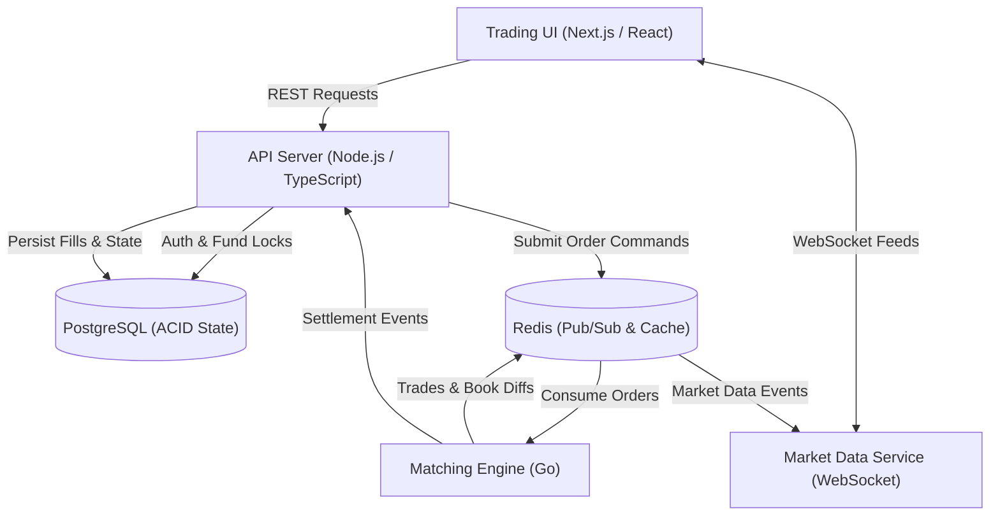
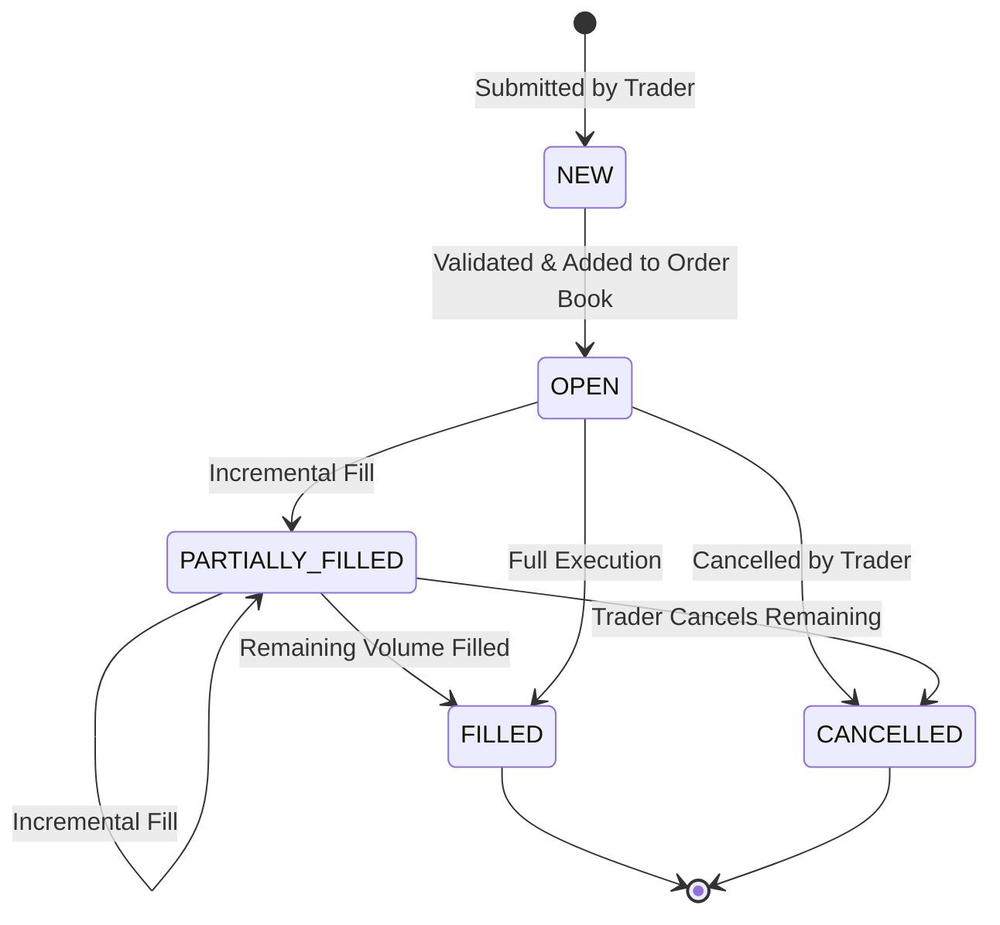

# ⚡ Crypto Exchange — High-Performance Trading Platform

A high-performance, event-driven cryptocurrency exchange and paper trading platform. Built for sub-millisecond in-memory order matching, real-time market data streaming, and strict financial ledger consistency.

[](#)
[-orange.svg)](#)
[-00ADD8.svg)](#)
[](#)
[](#)

---

## 📌 Table of Contents

- [Overview](#-overview)
- [Key Features](#-key-features)
- [System Architecture](#-system-architecture)
- [Technology Stack](#-technology-stack)
- [Order Lifecycle & State Machine](#-order-lifecycle--state-machine)
- [System Invariants & Core Rules](#-system-invariants--core-rules)
- [API & WebSocket Specifications](#-api--websocket-specifications)
- [Repository Structure](#-repository-structure)
- [Documentation & References](#-documentation--references)

---

## 🚀 Overview

This crypto exchange system simulates live cryptocurrency trading on the **BTC/USDT** pair with paper money, eliminating financial risk while delivering institutional-grade architecture. It combines:

1. **Ultra-Low Latency In-Memory Matching Engine** written in **Go** using a Price-Time Priority (FIFO) algorithm.
2. **Robust API & Ledger Gateway** in **Node.js / TypeScript** handling account balances, fund locks, and transactional settlements in **PostgreSQL**.
3. **Real-Time Market Data Broadcaster** powered by **Redis Pub/Sub** and **WebSockets** for Level-2 depth diffs, live tickers, and user-specific order updates.
4. **Modern Trading Terminal** built with **Next.js**, **React**, and **Tailwind CSS**, featuring interactive candlestick charting and order placement.

---

## ✨ Key Features

### 📈 Trading & Execution
- **Order Types:** Limit orders (resting in book) and Market orders (immediate fill).
- **Matching Priority:** Price-Time Priority (FIFO) matching against resting liquidity.
- **Partial Fills & Cancellations:** Incremental fill execution and atomic order cancellations.
- **Idempotency:** Client-supplied tokens to prevent duplicate order executions.

### 💼 Positions & Leverage
- **Long / Short Positions:** Directional paper exposure with configurable leverage multipliers.
- **Dynamic P&L:** Real-time calculation of unrealized and realized P&L based on mark price.
- **Liquidation Monitoring:** Automated margin ratio tracking and liquidation triggers.

### 💰 Double-Entry Ledger & Balance Protection
- **Fund Escrow:** Balances are locked atomically upon limit order submission.
- **Zero Negative Balances:** Strict non-negativity guarantees across all accounts.
- **Auditability:** Immutable `BalanceTransaction` ledger tracking every deposit, lock, fill, and settlement.

### ⚡ Real-Time Streaming
- **Public Feeds:** Sub-second Level-2 order book depth, executed trade stream, and 24h ticker metrics.
- **Private Channels:** Authenticated streams for order fills, balance transitions, and position updates.

---

## 🏗️ System Architecture



### Component Breakdown

| Component | Stack | Primary Responsibilities |
| :--- | :--- | :--- |
| **Frontend** | Next.js, React, Tailwind CSS | Trading dashboard, Level-2 order book visualizer, candlestick charts, positions and wallet manager. |
| **API Server** | Node.js, TypeScript | Ingress gateway, JWT authentication, balance reservation/locking, order dispatch, and REST queries. |
| **Matching Engine** | Go | High-performance in-memory order book, FIFO execution, trade generation, and execution events. |
| **Market Data Service** | Node.js / Go, WebSockets | Scalable fan-out distributor pushing public ticks, depth diffs, and private execution notifications. |
| **PostgreSQL** | Relational Database | Authoritative ACID storage for users, accounts, balances, orders, trades, positions, and audit ledger. |
| **Redis** | In-Memory Cache & Broker | Fast message broker for order pipelines, book diff distribution, and pub/sub market feeds. |

---

## 🛠️ Technology Stack

- **Trading Terminal:** Next.js, React, TypeScript, Tailwind CSS, WebSockets
- **Backend API & Orchestration:** Node.js, TypeScript, Express / Fastify
- **Matching Engine:** Go (in-memory price-time priority book)
- **Persistence & Caching:** PostgreSQL, Redis (Pub/Sub & caching)
- **DevOps & Infrastructure:** Docker, Docker Compose, GitHub Actions
- **Observability:** Structured JSON Logging, Prometheus, OpenTelemetry

---

## 🔄 Order Lifecycle & State Machine



### Rules & Invariants
1. **Validation:** `NEW` orders must satisfy balance and lot-size checks before book entry.
2. **Terminal State Immutability:** An order in `FILLED` or `CANCELLED` state can never transition again.
3. **Cancellation Boundaries:** Cancellations only release the remaining, unfilled portion of an order.
4. **One-to-One Trade Mapping:** Every fill step produces an immutable `Trade` entity.

---

## ⚖️ System Invariants & Core Rules

> [!IMPORTANT]
> **Fundamental Financial Invariant:**  
> A trade must **never** create, destroy, or duplicate funds.

- **Matching Limit:** $\text{filled\_quantity} \le \text{quantity}$
- **Execution Bound:** $\text{trade.quantity} \le \min(\text{buy.remaining\_quantity},\ \text{sell.remaining\_quantity})$
- **Balance Conservation:** $\text{total\_balance} = \text{available\_balance} + \text{locked\_balance}$
- **Strict Non-Negativity:** $\text{available\_balance} \ge 0$ and $\text{locked\_balance} \ge 0$ at all times.
- **Position Reproducibility:** All position states must be strictly reconstructible from trade and settlement logs.

---

## 🔌 API & WebSocket Specifications

### REST API Endpoints Summary

| Scope | Method | Endpoint | Description | Auth |
| :--- | :--- | :--- | :--- | :---: |
| **Auth** | `POST` | `/api/auth/register` | User registration | No |
| | `POST` | `/api/auth/login` | Login and receive JWT | No |
| | `POST` | `/api/auth/logout` | Invalidate session | Yes |
| **Account** | `GET` | `/api/account` | Account details & profile | Yes |
| | `GET` | `/api/account/balances` | Query available and locked balances | Yes |
| **Market** | `GET` | `/api/markets` | List supported trading pairs (`BTC-USDT`) | No |
| | `GET` | `/api/markets/:symbol/orderbook` | Snapshot of Level-2 order book depth | No |
| | `GET` | `/api/markets/:symbol/trades` | Recent public trade executions | No |
| **Orders** | `POST` | `/api/orders` | Submit new Market / Limit order | Yes |
| | `GET` | `/api/orders` | List open & historical orders | Yes |
| | `GET` | `/api/orders/:id` | Fetch specific order details | Yes |
| | `DELETE` | `/api/orders/:id` | Cancel open or partial order | Yes |
| **Positions** | `GET` | `/api/positions` | Query active leveraged positions | Yes |
| | `GET` | `/api/positions/:symbol` | Query position for a specific pair | Yes |
| | `GET` | `/api/trades` | List user's execution history | Yes |
| | `GET` | `/api/balance-transactions` | Immutable balance ledger entries | Yes |

### WebSocket Channels

- **Public Channels:**
  - `orderbook:<symbol>` — Real-time depth snapshots and incremental deltas.
  - `trades:<symbol>` — Live stream of matched trades.
  - `ticker:<symbol>` — 24h high/low/volume and 1s price updates.
- **Private Channels (JWT Authenticated):**
  - `orders` — Individual order transitions (`OPEN`, `PARTIALLY_FILLED`, `FILLED`, `CANCELLED`).
  - `user_trades` — User fill notices, execution prices, and fees.
  - `balances` — Real-time fund locks, unlocks, and settlement updates.
  - `positions` — Real-time mark price, margin ratio, and P&L changes.

---

## 📁 Repository Structure

```text
crypto-exchange/
├── Docs/
│   ├── Architecture.md      # Detailed system & component architecture
│   └── Requirements.md      # Comprehensive specifications & NFRs
├── README.md                # Project landing page & technical summary
```

---

## 📖 Documentation & References

Detailed design documents are available in the [`Docs/`](Docs/) directory:
- [System Architecture](Docs/Architecture.md) — Comprehensive component breakdown and communication flows.
- [System Requirements & Specifications](Docs/Requirements.md) — Complete functional, non-functional, data model, and API/WebSocket specifications.